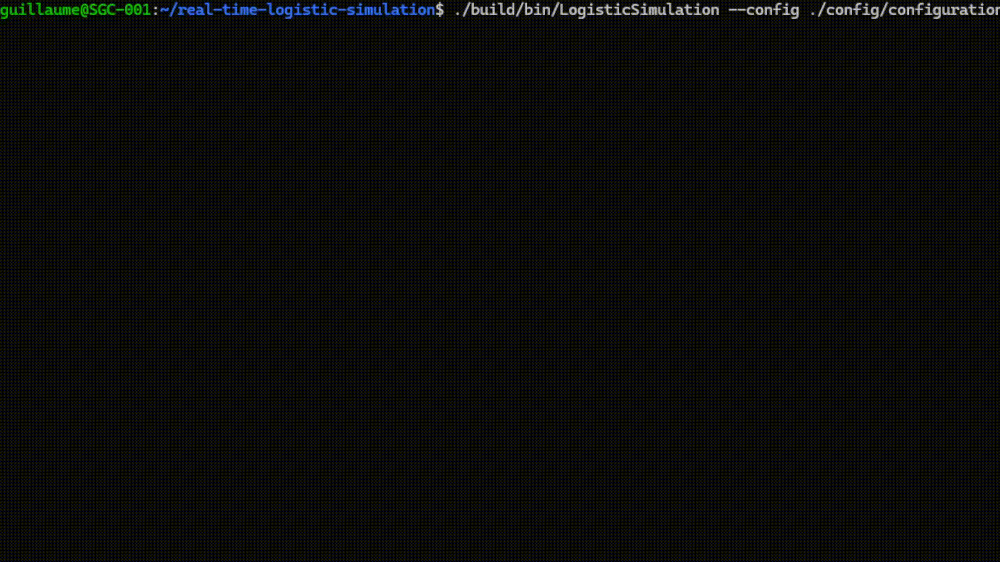

# Real Time Logistic Simulation

## Overview

This project aims to develop a real-time logistics platform simulator in
 C++, focusing on managing product flows and storage from reception to 
customer delivery. It employs multithreading to handle concurrent tasks 
efficiently, models spatial and temporal dimensions for accurate 
logistical constraints, and uses a flexible data model with singletons 
and JSON for storage. The simulator includes a real-time command-line 
interface for dynamic interaction and follows a structured workflow from
 initialization to termination. While some features like customer 
delivery logic and graphical result display are not fully implemented, 
the core real-time logic and data management are successfully 
integrated, providing a robust foundation for future extensions.

For detailed documentation, please refer to the [Real-Time Logistic Simulation Documentation](https://archive.org/details/real-time-logistic-simulation).



## Build Instructions

### Prerequisites

- CMake 3.10 or higher
- A C++17 compatible compiler

### Building the Project

To build the project, you can use the provided shell script for Unix-like systems or the batch script for Windows systems.

#### Unix-like Systems

```bash
./build.sh
```

#### Windows Systems

```cmd
build.bat
```

Alternatively, you can use CMake directly:

```bash
mkdir build
cd build
cmake ..
make
```

## Running the Project

After building the project, you can run the executable from the `bin` directory:

```bash
./bin/LogisticSimulation
```

## Real-time Shell Usage

The project includes a shell interface that allows for real-time interaction. Once the simulation is running, you can use the shell to monitor and control the simulation process.

## Configuration

### CLI Parameters

The project accepts command-line arguments to configure its behavior. These arguments are processed by the `Initializer` class. Ensure to pass the necessary parameters when executing the program.

### JSON Configuration

The project uses several JSON configuration files to load data:

- `config/configuration.json`: Main configuration file that references other JSON files.
- `config/references.json`: Contains reference data.
- `config/products.json`: Contains product data.
- `config/orders.json`: Contains order data.
- `config/parameters.json`: Contains simulation parameters.
- `config/logistics.json`: Contains logistics data.

Ensure these files are correctly configured before running the simulation.

## License

This project is licensed under the MIT License.
